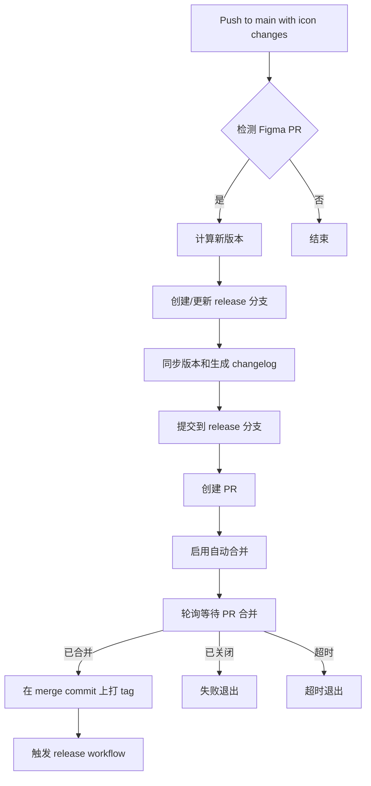

# GitHub 工作流 Code Review 报告

**审查日期**: 2026-06-29
**审查分支**: fix/release-with-protected-main
**审查文件**:
- `.github/workflows/ci.yml`
- `.github/workflows/release.yml`

---

## 📋 变更概述

本次修改重构了发布流程，从直接推送到 main 分支改为通过 Pull Request 的方式，以适配受保护的 main 分支规则。主要变更包括：

1. **CI 工作流** (`ci.yml`): 引入 GitHub App 认证、创建 Release PR、等待合并后打 tag
2. **Release 工作流** (`release.yml`): 移除了重复的 changelog 提交和版本同步任务

---

## ✅ 优点

### 1. 遵循受保护分支最佳实践
- ✅ 使用 PR 工作流而非直接推送到 main，符合 GitHub 分支保护规则
- ✅ 使用 GitHub App token 绕过分支保护（合法且推荐的方式）
- ✅ 通过 `--auto --squash` 实现自动合并，减少手动干预

### 2. 改进的权限管理
```yaml
permissions:
  pull-requests: write  # 从 read 升级为 write
```
- ✅ 正确配置了创建和合并 PR 所需的权限

### 3. 消除重复逻辑
- ✅ 移除了 `release.yml` 中的 changelog 提交步骤（现在在 CI 阶段完成）
- ✅ 移除了整个 `sync-versions` job（版本同步现在在 release PR 中完成）
- ✅ 移除了 `start-release` job（不再需要在 CI 中触发 release workflow）

### 4. 更好的幂等性
```bash
if git rev-parse -q --verify "refs/tags/v${VERSION}" >/dev/null; then
  echo "Release tag v${VERSION} already exists."
  exit 0
fi
```
- ✅ 检查 tag 是否已存在，避免重复创建

---

## ⚠️ 潜在问题

### 1. 🔴 高风险：等待逻辑的超时配置

**位置**: `ci.yml:256-277`

```bash
for attempt in {1..80}; do
  # ...
  sleep 30
done
```

**问题**:
- 最长等待时间：80 × 30s = **40 分钟**
- GitHub Actions 的 job 默认超时是 **360 分钟**，但 40 分钟对于一个 PR 合并来说过长
- 如果 PR 需要通过 status checks 或有其他自动化流程，可能会导致不必要的长时间等待

**建议**:
```bash
# 建议调整为 30 次尝试，总计 15 分钟
for attempt in {1..30}; do
  # ...
  sleep 30
done
```

### 2. 🟡 中风险：缺少 PR 合并失败的处理

**位置**: `ci.yml:254`

```bash
gh pr merge "$pr_number" --repo "$GITHUB_REPOSITORY" --auto --squash --subject "chore(release): prepare v${VERSION}"
```

**问题**:
- `--auto` 标志只是启用自动合并，但如果 PR 不满足合并条件（如 status checks 失败），不会立即报错
- 后续的等待循环会一直等待，直到超时

**建议**:
```bash
# 在设置自动合并时检查返回值
if ! gh pr merge "$pr_number" --repo "$GITHUB_REPOSITORY" --auto --squash --subject "chore(release): prepare v${VERSION}"; then
  echo "Failed to enable auto-merge for PR #${pr_number}. Check if branch protection rules are satisfied." >&2
  exit 1
fi
```

### 3. 🟡 中风险：`--force-with-lease` 在新分支上的行为

**位置**: `ci.yml:240`

```bash
git push --force-with-lease origin "$release_branch"
```

**问题**:
- 如果是新创建的分支，`--force-with-lease` 的保护作用有限
- 如果是已存在的分支且被重置（`git reset --hard`），强制推送可能会覆盖远程的非预期更改

**建议**:
```bash
# 对于新分支，使用普通 push
# 对于已存在的分支，先验证是否需要强制推送
if git ls-remote --exit-code --heads origin "$release_branch" >/dev/null 2>&1; then
  git push --force-with-lease origin "$release_branch"
else
  git push -u origin "$release_branch"
fi
```

### 4. 🟡 中风险：缺少 Branch Protection 状态检查

**位置**: `ci.yml:202-254`

**问题**:
- 代码假设 PR 会自动合并，但没有显式检查 branch protection rules
- 如果 main 分支需要 status checks、reviews 或其他要求，PR 可能无法自动合并

**建议**:
```bash
# 在创建 PR 后，检查 branch protection 状态
protection_status="$(gh api "repos/$GITHUB_REPOSITORY/branches/main/protection" --jq '.required_status_checks' 2>/dev/null || echo "{}")"
if [[ "$protection_status" != "{}" ]]; then
  echo "⚠️ Main branch has required status checks. PR will merge after checks pass."
fi
```

### 5. 🟡 中风险：用户配置不一致

**位置**: `ci.yml:235-236`

```bash
git config user.name "ycloud-icons-source-bot[bot]"
git config user.email "ycloud-icons-source-bot[bot]@users.noreply.github.com"
```

**问题**:
- 在旧版本中使用的是 `github-actions[bot]`
- 现在改为 `ycloud-icons-source-bot[bot]`，但这个 bot 是否已正确配置？
- 如果 GitHub App 的名称与此不匹配，能导致提交归属问题

**建议**:
```bash
# 从 GitHub App token 中获取实际的 bot 用户名
app_slug="$(gh api user --jq '.login')"
git config user.name "${app_slug}[bot]"
git config user.email "${app_slug}[bot]@users.noreply.github.com"
```

### 6. 🟢 低风险：错误处理可以更完善

**位置**: 多处

**问题**:
- 某些 `gh` 和 `git` 命令缺少显式的错误检查
- bash 脚本默认在错误时不会退出（除非设置 `set -e`）

**建议**:
```bash
# 在脚本开头添加严格模式
set -euo pipefail

# 或者对关键命令添加错误检查
if ! git push --force-with-lease origin "$release_branch"; then
  echo "Failed to push release branch" >&2
  exit 1
fi
```

### 7. 🟢 低风险：硬编码的重试参数

**位置**: `ci.yml:261`

```bash
for attempt in {1..80}; do
```

**建议**:
使用环境变量或 workflow 输入来配置重试次数，提高灵活性：
```yaml
env:
  MAX_PR_WAIT_ATTEMPTS: 30
  PR_WAIT_INTERVAL_SECONDS: 30
```

---

## 🔍 工作流逻辑分析

### CI 工作流新流程



### Release 工作流改进

**移除的重复任务**:
- ❌ ~~提交 changelog 到 main~~ (已在 CI 的 release PR 中完成)
- ❌ ~~同步 package 版本到 main~~ (已在 CI 的 release PR 中完成)
- ❌ ~~`start-release` job~~ (CI 不再需要调用 release workflow)

**保留的核心任务**:
- ✅ 发布 NPM 包
- ✅ 创建 GitHub Release
- ✅ 生成双语 release notes

---

## 🛡️ 安全考量

### 1. GitHub App Token 的使用

```yaml
- name: Generate GitHub App token
  id: app-token
  uses: actions/create-github-app-token@v2
  with:
    app-id: ${{ secrets.YCLOUD_ICONS_APP_ID }}
    private-key: ${{ secrets.YCLOUD_ICONS_APP_PRIVATE_KEY }}
```

**✅ 正确的做法**:
- 使用 GitHub App 而非 Personal Access Token (PAT)
- 可以绕过分支保护规则（如果 App 有相应权限）
- 遵循最小权限原则

**⚠️ 注意事项**:
- 确保 GitHub App 已正确配置并授予 repository 权限
- 定期审计 App 的权限范围
- 私钥必须安全存储在 secrets 中

### 2. HUSKY=0 的使用

```bash
HUSKY=0 git commit -m "chore(release): prepare v${VERSION}"
```

**✅ 正确**:
- 在 CI 环境中禁用 git hooks 是合理的
- 避免在自动化流程中触发本地开发钩子

---

## 📊 性能影响

### 1. 新增的等待时间

| 阶段 | 预估时间 |
|------|---------|
| 创建 PR | ~5s |
| 等待 PR 合并 | 0-40min (取决于 status checks) |
| 总开销 | +0-40min |

**建议**: 如果 main 分支有必需的 CI checks，确保它们能快速完成，或者考虑为 release PR 设置不同的 branch protection 规则。

### 2. 减少的 Git 操作

- ✅ 移除了 `sync-versions` job，减少了一次完整的 checkout + push 循环
- ✅ 移除了 changelog 的二次提交

---

## 🎯 建议优先级

### 立即修复 (P0)

1. **调整等待超时时间** 从 40 分钟降到 15 分钟
2. **添加 PR 合并失败的显式错误处理**

### 短期改进 (P1)

3. **验证 GitHub App 配置** 确保 bot 用户名正确
4. **改进 `--force-with-lease` 逻辑** 区分新分支和已存在分支
5. **添加 branch protection 状态检查**

### 长期优化 (P2)

6. **添加脚本严格模式** (`set -euo pipefail`)
7. **将硬编码参数提取为配置**
8. **添加更详细的日志和进度提示**

---

## 📝 代码片段建议

### 改进的等待和合并逻辑

```bash
# 改进后的版本
- name: Prepare and merge release PR
  id: release-pr
  shell: bash
  env:
    # ... (保持现有环境变量)
    MAX_WAIT_ATTEMPTS: 30  # 15 分钟
    WAIT_INTERVAL: 30
  run: |
    set -euo pipefail

    release_branch="release/v${VERSION}"

    # 创建或更新分支
    if git ls-remote --exit-code --heads origin "$release_branch" >/dev/null 2>&1; then
      echo "Updating existing release branch: $release_branch"
      git fetch origin "$release_branch"
      git switch "$release_branch"
      git reset --hard "origin/$release_branch"
    else
      echo "Creating new release branch: $release_branch"
      git switch -c "$release_branch"
    fi

    # 准备 release 文件
    node ./scripts/syncPackageVersions.mts "$VERSION"
    node ./scripts/writeChangelog.mts

    git add packages/*/package.json CHANGELOG.md docs/.vitepress/data/CHANGELOG.en.md docs/.vitepress/data/changelogSidebar.ts
    if [ -f "changelogs/releases/v${VERSION}.json" ]; then
      git add "changelogs/releases/v${VERSION}.json"
    fi

    if git diff --cached --quiet; then
      echo "No release preparation changes to commit."
    else
      # 从 GitHub App 获取实际的 bot 用户信息
      bot_user="$(gh api user --jq '.login')"
      git config user.name "${bot_user}[bot]"
      git config user.email "${bot_user}[bot]@users.noreply.github.com"
      HUSKY=0 git commit -m "chore(release): prepare v${VERSION}"
    fi

    # 推送分支
    if git ls-remote --exit-code --heads origin "$release_branch" >/dev/null 2>&1; then
      git push --force-with-lease origin "$release_branch"
    else
      git push -u origin "$release_branch"
    fi

    # 创建或获取 PR
    pr_number="$(gh pr list --repo "$GITHUB_REPOSITORY" --head "$release_branch" --state open --json number --jq '.[0].number // empty')"
    if [[ -z "$pr_number" ]]; then
      echo "Creating new release PR..."
      gh pr create \
        --repo "$GITHUB_REPOSITORY" \
        --base main \
        --head "$release_branch" \
        --title "chore(release): prepare v${VERSION}" \
        --body "Prepare repository files for v${VERSION} before publishing packages."
      pr_number="$(gh pr list --repo "$GITHUB_REPOSITORY" --head "$release_branch" --state open --json number --jq '.[0].number')"
    else
      echo "Found existing release PR #${pr_number}"
    fi

    # 启用自动合并并检查结果
    echo "Enabling auto-merge for PR #${pr_number}..."
    if ! gh pr merge "$pr_number" --repo "$GITHUB_REPOSITORY" --auto --squash --subject "chore(release): prepare v${VERSION}"; then
      echo "❌ Failed to enable auto-merge. This may indicate:" >&2
      echo "  - Required status checks are not satisfied" >&2
      echo "  - Required reviews are missing" >&2
      echo "  - Branch protection rules prevent auto-merge" >&2
      exit 1
    fi

    echo "number=$pr_number" >> "$GITHUB_OUTPUT"

- name: Wait for release PR and push tag
  shell: bash
  env:
    GH_TOKEN: ${{ steps.app-token.outputs.token }}
    VERSION: ${{ steps.new-version.outputs.NEW_VERSION }}
    PR_NUMBER: ${{ steps.release-pr.outputs.number }}
    MAX_WAIT_ATTEMPTS: 30
    WAIT_INTERVAL: 30
  run: |
    set -euo pipefail

    merge_commit=""

    echo "Waiting for release PR #${PR_NUMBER} to merge (max ${MAX_WAIT_ATTEMPTS} attempts)..."
    for attempt in $(seq 1 "$MAX_WAIT_ATTEMPTS"); do
      pr_json="$(gh pr view "$PR_NUMBER" --repo "$GITHUB_REPOSITORY" --json state,mergeCommit,statusCheckRollup)"
      state="$(jq -r '.state' <<< "$pr_json")"

      if [[ "$state" == "MERGED" ]]; then
        merge_commit="$(jq -r '.mergeCommit.oid' <<< "$pr_json")"
        echo "✅ Release PR #${PR_NUMBER} has been merged (commit: ${merge_commit})"
        break
      fi

      if [[ "$state" == "CLOSED" ]]; then
        echo "❌ Release PR #${PR_NUMBER} was closed without merging." >&2
        exit 1
      fi

      # 显示当前状态
      checks_summary="$(jq -r '.statusCheckRollup[]? | select(.conclusion != null) | "\(.context): \(.conclusion)"' <<< "$pr_json" | head -3)"
      if [[ -n "$checks_summary" ]]; then
        echo "  Status checks preview:"
        echo "$checks_summary" | sed 's/^/    /'
      fi

      echo "  Attempt ${attempt}/${MAX_WAIT_ATTEMPTS} - PR state: ${state}"
      sleep "$WAIT_INTERVAL"
    done

    if [[ -z "$merge_commit" || "$merge_commit" == "null" ]]; then
      echo "❌ Timed out waiting for release PR #${PR_NUMBER} to merge after $((MAX_WAIT_ATTEMPTS * WAIT_INTERVAL / 60)) minutes." >&2
      echo "Check the PR for failing status checks or missing reviews:" >&2
      echo "  https://github.com/${GITHUB_REPOSITORY}/pull/${PR_NUMBER}" >&2
      exit 1
    fi

    # 获取最新的 main 和 tags
    git fetch origin main --tags

    # 检查 tag 是否已存在
    if git rev-parse -q --verify "refs/tags/v${VERSION}" >/dev/null; then
      echo "ℹ️ Release tag v${VERSION} already exists, skipping tag creation."
      exit 0
    fi

    # 在 merge commit 上创建 tag
    echo "Creating release tag v${VERSION} on commit ${merge_commit}..."
    git tag "v${VERSION}" "$merge_commit"
    git push origin "v${VERSION}"
    echo "✅ Successfully created and pushed tag v${VERSION}"
```

---

## 🎬 总结

### 总体评价: ✅ **良好**

本次重构成功地将发布流程从直接推送改为 PR 驱动，这是一个重要的改进。代码整体质量良好，逻辑清晰，但仍有一些可以改进的地方。

### 关键成就
- ✅ 成功适配受保护的 main 分支
- ✅ 消除了重复的版本同步和 changelog 提交逻辑
- ✅ 使用 GitHub App 认证，安全性更好
- ✅ 良好的幂等性设计

### 需要关注的风险
- ⚠️ 等待超时时间过长（40 分钟）
- ⚠️ 缺少对 PR 合并失败的显式处理
- ⚠️ 部分错误处理可以更完善

### 建议行动
1. **立即**: 调整等待超时并添加错误处理
2. **本周**: 验证 GitHub App 配置和 bot 用户名
3. **下个迭代**: 添加脚本严格模式和更好的日志

---

**审查人**: Claude (Opus 4.8)
**审查方法**: 静态代码分析 + 工作流逻辑验证
